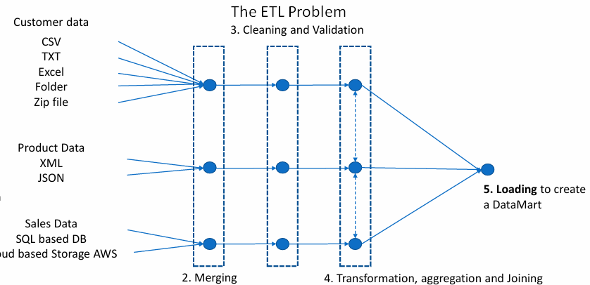

# 🪑 Furniture Sales Data ETL Pipeline 🪑  
**Using Pentaho Data Integration (PDI)/Kettle ⚙**  

---

### 📃 Table of Contents:
- [Overview](#-overview)
- [Tools Used](#-tools-used)
- [Project Documentation](#-project-documentation)
- [ETL Process](#-ETL-Process)
- [Setup Instructions](#-setup-instructions)

---

## 🖋 Overview  
This project demonstrates the use of **Pentaho Data Integration (PDI)** to automate the processing of sales data for a furniture company. The pipeline extracts data from multiple sources (CSV, PostgreSQL, AWS S3, Excel, Zip Files, XML, JSON), cleans and validates it, and loads it into a centralized data warehouse.  

 

---

## 🛠 Tools Used  
- **Pentaho Data Integration (PDI) 9.0.0**  
- **PostgreSQL**  
- **AWS S3**  
- **pgAdmin**  

---

## 📂 Project Documentation  
- **[Transformations](../transformations)**  
- **[Jobs](../jobs)**  
- **[Screenshots](../screenshots)**  
- **[Data](../data)**  

---

## 📌 ETL Process  
1. **Extract, Clean, and Load Customer Data**  

- **Data Sources:** The data comes from CSV, TXT, and ZIP files.  
  > Steps used:  
  - **Text File Input:** For CSV, TXT, and ZIP files.  
  - **Excel File Input:** For Excel files.  
  - **Data Grid:** For manual data entry.  

- **Data Cleaning and Transformation:**  
  - Sorted and merged data.  
  - Removed duplicates.  
  - Cleaned data fields using **Replace in String**, **Calculate**, **Fuzzy Match**and **Value Mapper** steps.  

    

- **Loading Data:** The cleaned data is stored in the **Customer** table using the **Combination Lookup/Update** step.  

  

2. **Extract Product Data**  

- **Data Sources:** The data comes from XML and JSON Files.  
  > Steps used:  
  - **Get data from XML:** For XML files.  
  - **JSON Input:** For Json files.  

- **Data Cleaning and Transformation:**  
  - Sorted and merged data.  
  - Removed duplicates.
    
   

- **Loading Data:** The cleaned data is stored in the **Product** table using the **Dimension Lookup/Update** step.  

  

3. **Extract Sales Data**  
   - From PostgreSQL Table and AWS S3.
- **Data Sources:** The data comes from PostgreSQL Table and AWS S3.  
  > Steps used:
  - **Table Input:** For Excel files.  
  - **Hadoop File Input:** For ASW S3, Files from Hadoop.

- **Data Cleaning and Transformation:**  
  - Sorted and merged data.  
  - Removed duplicates.  
  - Cleaned data fields using **Formula**, **Calculate**, **Stream loopup**and **Filter Rows** steps.
    
   

- **Loading Data:** The cleaned data is stored in the **Product** table using the **Dimension Lookup/Update** step.
  

4. **Automate the Pipeline**  
   - Using Pentaho jobs.  
     

7. **Schedule the Job**  
   - Using Windows Task Scheduler or Cron.  
   

---

## 🛠 Setup Instructions  
1. **Install Pentaho Data Integration (PDI)**  
   - Download and install from [here](https://sourceforge.net/projects/pentaho/).  

2. **Set Up PostgreSQL and AWS S3**  
   - Use the scripts provided in the `scripts/` folder.  

3. **Run Transformations and Jobs**  
   - Execute the transformations and jobs in the `transformations/` and `jobs/` folders.  

---

## 🙌 Support Me!  
👉 If you find this project useful, please ⭐ this repository  
